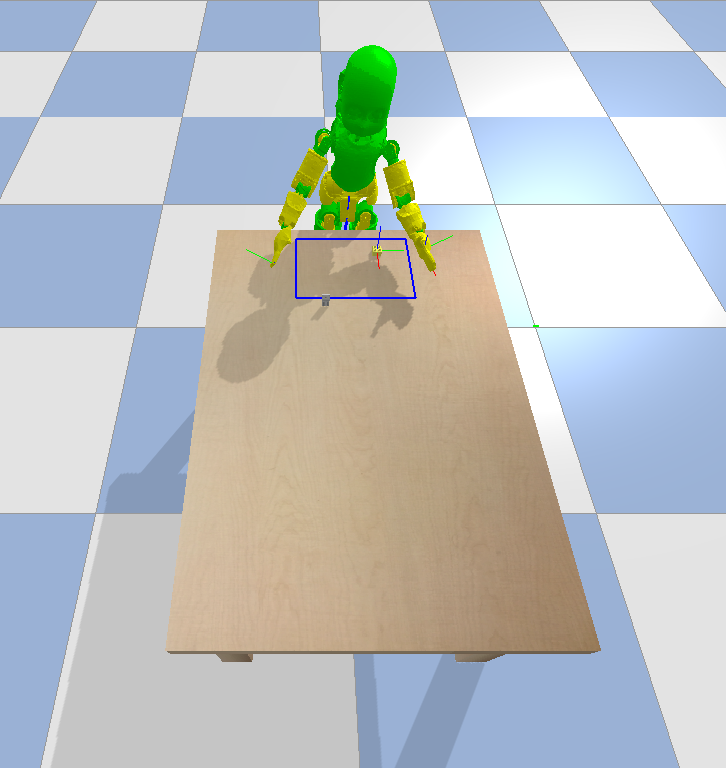
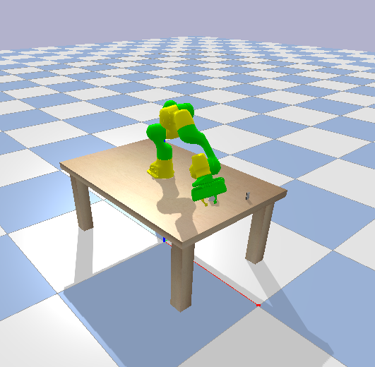

<p align="center">
<h1 align="center">Pybullet-robot-envs</h1>
</p>
<p align="center">
<h align="center"> ⚠️ Status: Pre-alpha ⚠️ </h>
</p>

---

**pybullet-robot-envs** is a *Python* package that collects robotic environments based on the [PyBullet](https://github.com/bulletphysics/bullet3) simulator, suitable to develop and test Reinforcement Learning algorithms on simulated **grasping** and **manipulation** applications.

The pybullet-robot-envs inherit from the [OpenAI Gym](https://github.com/openai/gym/tree/master/gym) interface.

The package provides environments for the **iCub Humanoid robot** and the **Franka Emika Panda manipulator**.

<p align="center">
  
  
</p>


## Overview
 - [Motivation](#motivation)
 - [Prerequisites](#prerequisites)
 - [Installation](#installation)
    - [Testing](#testing)
 - [Environments](#environments)
    - [Test Environments](#test-environments)
 - [RL Examples](#rl-examples)

---

## Motivation
This repository is part of a project which aims to develop Reinforcement Learning approaches for the accomplishment of grasp and manipulation tasks with the iCub Humanoid robot and the Franka Emika Panda robot.

A Reinforcement Learning based approach generally includes two basics modules: the **environment**, i.e. the world, and the **agent**, i.e. the algorithm. The agent sends action to the environment, which replies with observations and rewards. This repository provides environments with OpenAI Gym interface that interact with the [PyBullet](https://github.com/bulletphysics/bullet3) module to simulate the robotic tasks and the learned policies.

Simulators are a useful resource to implement and test Reinforcement Learning algorithm on a robotic system before porting them to the real-world platform, in order to avoid any risk for the robot and the environment. [PyBullet](https://github.com/bulletphysics/bullet3) is a Python module for physics simulation for robotics, visual effect and reinforcement learning based on the Bullet Physics SDK. See [PyBullet Quickstart Guide](https://docs.google.com/document/d/10sXEhzFRSnvFcl3XxNGhnD4N2SedqwdAvK3dsihxVUA/edit#heading=h.2ye70wns7io3) for specific information. Its main features are:
- It is possible to load **urdf/sdf** models;
- Interactive OpenGL GUI;
- It is possible to control robots (**forward/inverse dynamics and kinematics**);
- Options in camera rendering;
- RL framework:
    - a suit for gym environments is installed together with PyBullet;
    - It includes pybullet version of openai gym envs;
- Also VR is available.

The pybullet-robot-envs environments adopt the OpenAI Gym environment interface, that has become as sort of standard in the RL world. RL agents can easily interact with different environments through this common interface without any additional implementation effort. An OpenAI Gym interface has the following basic methods:
 - *reset(self)*: Reset the environment's state. It returns an observation.
 - *step(self,action)*: Step the environment by one timestep. Returns observation, reward, done, info.
 - *render(self, mode='human')*: Render one frame of the environment.


## Prerequisites
*pybullet-robot-envs* requires **python3** (>=3.5).

## Installation
1. Before installing the required dependencies, you may want to create a virtual environment and activate it:
    ```
    $ virtualenv ve_pybullet
    $ source ve_pybullet/bin/activate
    ```
2. Install **git lfs** by following instructions here: [git-lfs.github.com](https://git-lfs.github.com/).
3. Clone the repository:
    ```
    $ git clone https://github.com/robotology-playground/pybullet-robot-envs.git
    $ cd pybullet-robot-envs
    ```
4. Install the dependencies necessary to run and test the environments with PyBullet:
    ```
    $ pip3 install -r requirements.txt
    ```
    **Note:** Installing the requirements will install also [Stable Baselines](https://github.com/hill-a/stable-baselines/).

5. Install the package:
    ```
    $ pip3 install -e .
    ```
    After this step, they can be instantiated in any script by doing:
      ```
      import gym
      env = gym.make('pybullet_robot_envs:iCubReach-v0')
      ```
    where `iCubReach-v0` is the environment id. You can check the available environment ids in the file [pybullet_robot_envs/__init__.py](pybullet_robot_envs/__init__.py). If you create a new environment and you want to register it as Gym environment, you can modify this file by adding a new `register( id=<id_env>, entry_point=path_to_import_env>)`. See [this](https://github.com/openai/gym/blob/master/docs/creating-environments.md) guide for detailed instruction.

### Testing
You can test your installation by running the following basic robot simulations on PyBullet:
```
$ python pybullet_robot_envs/examples/helloworlds/helloworld_icub.py
$ python pybullet_robot_envs/examples/helloworlds/helloworld_panda.py
```

## Environments
The [README.md](pybullet_robot_envs/README.md) file provides detailed information about the robotic environments of the repository. In general, there are three types of environments:
- **Robot environments**: load the URDF/SDF robot models and provide methods to directly interact with the robot in the simulation. They are not OpenAI Gym-like environments.
- **Task environments**: provide the implementation of the RL task and are OpenAI Gym-like environments. Inside the task environment, the specific robot environment is instantiated.
- **World environment**: load the objects into the scene and provide methods to observe the object states during the simulation. 
### Test Environments

##### iCub
Run the following script to open an interactive GUI in PyBullet and test the iCub environment:
* Forward Kinematic: use the sliders to change the positions of the iCub arm's joints
  ```
  $ python pybullet_robot_envs/examples/test_envs/test_icub_push_gym_env.py --arm l --joint
  ```
* Inverse Kinematic: use the sliders to change the (x,y,z),(roll,pitch,yaw) position of the iCub's hand
  ```
  $ python pybullet_robot_envs/examples/test_envs/test_icub_push_gym_env.py --arm l 
  ```
  
* Random policy: test a random policy, both in cartesian and joint control spaces by adding `--random_policy`
  ```
  $ python pybullet_robot_envs/examples/test_envs/test_icub_push_gym_env.py --arm l --random_policy
  ```
##### Panda
Run the following script to open an interactive GUI in pybullet and test the Panda environment:

* Forward Kinematic: use the sliders to change the positions of the iCub arm's joints
  ```
  $ python pybullet_robot_envs/examples/test_envs/test_panda_push_gym_env.py
  ```
* Inverse Kinematic: use the sliders to change the (x,y,z),(roll,pitch,yaw) position of the iCub's hand
  ```
  $ python pybullet_robot_envs/examples/test_envs/test_panda_push_gym_env.py --cart 
  ```
  
* Random policy: test a random policy, both in cartesian and joint control spaces by adding `--random_policy`
  ```
  $ python pybullet_robot_envs/examples/test_envs/test_panda_push_gym_env.py --random_policy
  ```


## RL Examples
Run the following scripts to train and test the implemented environments with standard DDPG algorithm from [Stable Baselines](https://github.com/hill-a/stable-baselines/).

You can find more examples in the repository [https://github.com/eleramp/robot-agents](https://github.com/eleramp/robot-agents) which is a Python-based framework composed of two main cores:
  - **robot_agents**: collection of scripts to train and test with different RL algorithms
  - **Evaluation**: scripts to easily setup and evaluate different experiments. You can define in one script a list of experiments by specifying for each one Gym-like environment and RL algorithm, and then evaluate their training or testing by running a single script.

##### iCubPush-v0

* Train iCub to perform a *push* task by using **Stable Baselines** implementation of [DDPG](https://github.com/hill-a/stable-baselines/tree/master/stable_baselines/ddpg) (continuous action space):
  ```
  $ python pybullet_robot_envs/examples/algos/train/baselines/icub_envs/train_ddpg_pushing.py
  ```
  The trained model is saved as *.pkl* in the `../pybullet_logs/icubpush_ddpg` folder, together with some log files, as *tensorboard* files.

* Track the learning process with tensorboard:
  1. Run tensorboard by specifying the log directory:
      ```
      $ tensorboard --logdir ../pybullet_logs/icubpush_ddpg
        TensorBoard 1.13.1 at <url>:6006 (Press CTRL+C to quit)
      ```
  2. Enter the `<url>:6006` into the web browser and track the mean reward per episode


* Test the trained model on episodes of 1000 timestamps:
  ```
  $ python pybullet_robot_envs/examples/algos/test/baselines/icub_envs/test_ddpg_pushing.py
  ```

##### PandaReach-v0

* Train panda to perform a *reach* task by using **Stable Baselines** implementation of [DDPG](https://github.com/hill-a/stable-baselines/tree/master/stable_baselines/ddpg) (continuous action space):
  ```
  $ python pybullet_robot_envs/examples/algos/train/baselines/panda_envs/train_ddpg_reaching.py
  ```
  The trained model is saved as *.pkl* in the `../pybullet_logs/pandareach_ddpg` folder, together with some log files, as *tensorboard* files.

* Track the learning process with tensorboard:
  1. Run tensorboard by specifying the log directory:
      ```
      $ tensorboard --logdir ../pybullet_logs/pandareach_ddpg
        TensorBoard 1.13.1 at <url>:6006 (Press CTRL+C to quit)
      ```
  2. Enter the `<url>:6006` into the web browser and track the mean reward per episode


* Test the trained model on episodes of 1000 timestamps:
  ```
  $ python pybullet_robot_envs/examples/algos/test/baselines/panda_envs/test_ddpg_reaching.py
  ```
